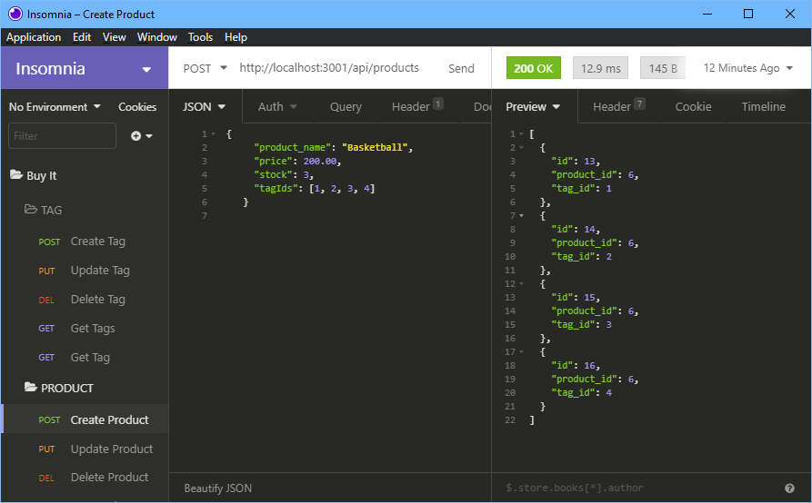

# Buy-It
Back end for an e-commerce site using express.js, MySQL2 and Sequelize.

# Installation

Clone the repositry from GitHub and open using Visual Studio Code.

# Usage 
[Demo Viedo](https://drive.google.com/file/d/1kR5lw5sJlITELfoM9XzxWWNWmD4t85m_/view?usp=sharing)

# Credits

Made by [Russ Tracy]

[express.js](https://www.npmjs.com/package/express)

[Node MySQL 2](https://www.npmjs.com/package/mysql2)

[Sequelize](https://www.npmjs.com/package/sequelize)

[dotenv](https://www.npmjs.com/package/dotenv)

# Questions

[Contact Me](russ_tracy@comcast.net)

[GitHub](https://github.com/russtracy)
